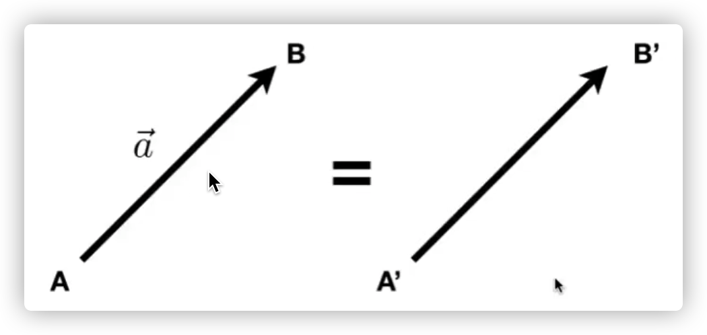
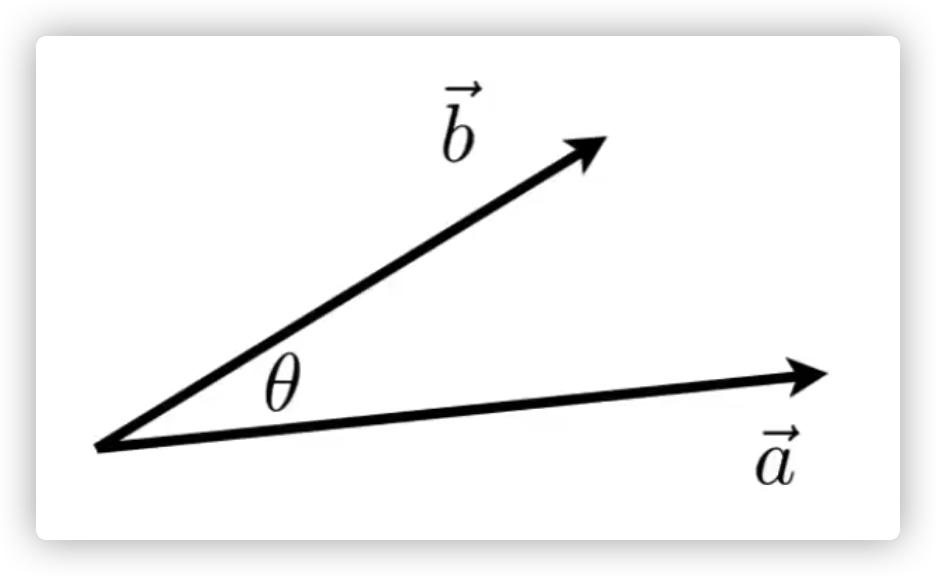

# 向量

- 通常写成$$\vec{a}$$或者**a**

- 或者使用起始/结束点$$\vec{AB}$$=B - A
- 表示方向和长度（||$$\vec{AB}$$||）
- 没有绝对的起始位置

#### 乘法

- 点乘

  Dot(scalar)Produce

  -  $$\vec{a}\cdot\vec{b}=\parallel\vec{a}\parallel\parallel\vec{b}\parallel\cos\theta$$

  - $$cos\theta=\frac{\vec{a}\cdot\vec{b}}{\parallel\vec{a}\parallel\parallel\vec{b}\parallel}$$

    > 点乘符合交换律、结合律、分配律

- 

